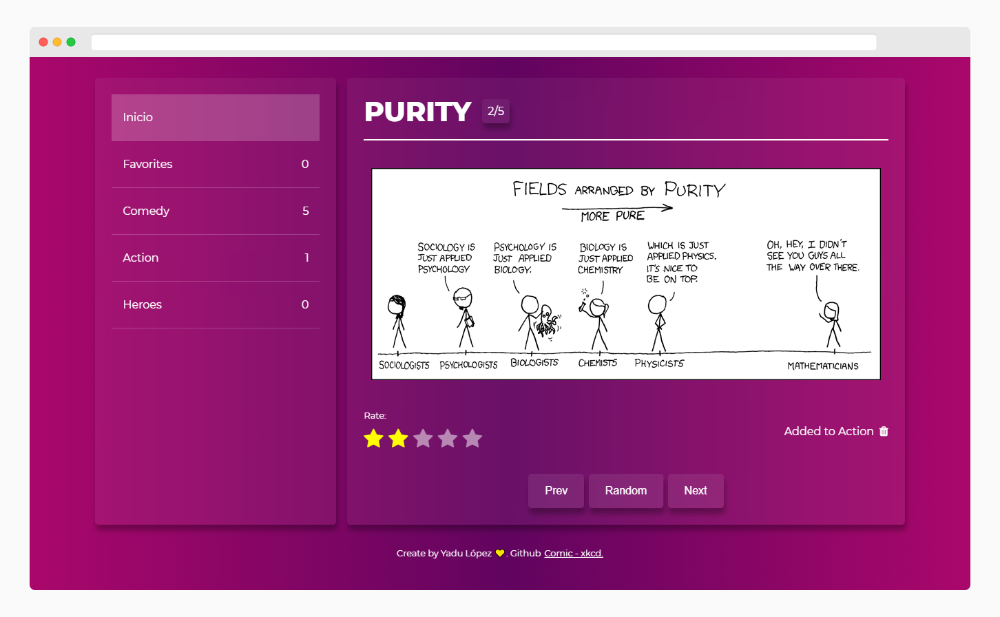

# Comic | xkcd 👧

Consumo de api de [xkcd](https://xkcd.com/)

## Demo 🚀

[View Demo](https://yadurani.github.io/comic-app/)

## Tools 🚀

- React.js
- Redux
- Webpack
- Sass

## Installation 🛴

Clone la app

```bash
git clone https://github.com/yadurani/comic-app.git
```

Instale las dependencias

```bash
yarn install 'or' npm install
```

Corra el proyecto

```bash
yarn dev 'or' npm run dev
```

## Overview 🔖


